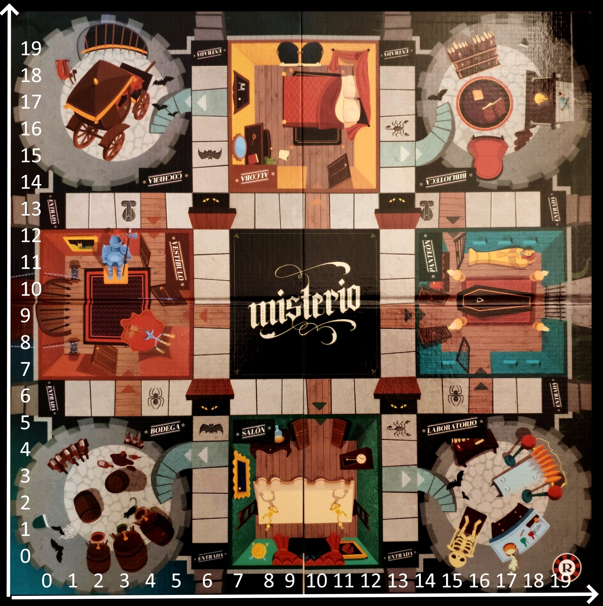

# Misterio backend

- [Install](#install)
- [Run](#run)
- [Tests](#tests)
- [Notes for developers](#notes-for-developers)
- [Board organization](#board-organization)
- [Websockets protocol](#websockets-protocol)
  * [Definitions](#definitions)
  * [Chat endpoint](#chat-endpoint)
    + [Send message](#send-message)
  * [Lobby endpoint](#lobby-endpoint)
    + [Join lobby](#join-lobby)
    + [Create lobby](#create-lobby)
    + [Leave lobby](#leave-lobby)
    + [Start match](#start-match)
  * [Match endpoint](#match-endpoint)
    + [Roll dice](#roll-dice)
    + [Get hand](#get-hand)
    + [Use Salem Witch](#use-salem-witch)
    + [End turn](#end-turn)
    + [Move](#move)
    + [Accuse](#accuse)
    + [Suspect](#suspect)
    + [Suspect response](#suspect-response)
    + [Leave Match](#leave-match)


# Install


- ```python -m pip install -r requirements.txt```

# Run


- ```python -m uvicorn main:app --reload```

# Tests


- ```python -m unittest discover tests/```

# Notes for developers


- All tests using the FastAPI test client should extend the TestCaseFastAPI class

# Board organization

There's a set of x,y coordinates assigned to every square in the board. 
If a player steps into a square that leads to a room, that player is 
considered to be in that room. Invalid squares (i.e, the square (1,1)) are set as null.



# Websockets protocol

## Definitions

Lobby:
``` {'name': str, 'host': str, 'current_players': int, 'players': [str] }```


Match:
```{'name': self.name, 'players': [str], 'turn': str, 'player_positions': [{pos_x: <int>, pos_y: <int>, player_name: <string>}]}```

Card:
```{'type': CardType, 'name': str}```

CardType = ```{MONSTER, VICTIM, ROOM, SALEM_WITCH}```


Error:
```{'action': 'failed', 'info': str}```
* All endpoints return Error if there was one

## Chat endpoint

### Send message

*chat_name* is the lobby/match name

Takes (in lobby):
```{'action': 'chat_lobby_send', 'player_name': <str>, 'chat_name': <str>, 'message': <str>}```

Takes (in match):
```{'action': 'chat_match_send', 'player_name': <str>, 'chat_name': <str>, 'message': <str>}```

*message* has the form **hour: minutes, day / month - sender: 'msg'**

```Example: 11:59, 10/11 - Host: Test message```

Returns:
```{'action': 'new_message', 'message': <str>, 'author': <str>, 'timestamp': <int>}```

* _Timestamp_ is the date the message was received formated using [Unix Timestamp](https://en.wikipedia.org/wiki/Unix_time)

## Lobby endpoint

### Join lobby

Takes: 
```{'action': 'lobby_join', 'player_name': str, 'lobby_name': str}```

Returns:

To sender

```{'action': 'joined_lobby', 'lobby': Lobby, 'chat': [<string>]}```

To other players in the room

``` {'action': 'new_player', 'player_name': str} ```


### Create lobby
Takes: ```{'action': 'lobby_create', 'player_name': str, 'lobby_name': str}```

Returns:
```{'action': 'new_lobby', 'lobby': Lobby}```

### Leave lobby

Takes:
```{'action': 'lobby_leave', 'player_name': <str>, 'lobby_name': <str>}  ```

Returns:
```{'action': 'player_left', 'player_name': <str>}```


### Start match

Takes: 
```{'action': 'lobby_start_match', 'player_name': str, 'lobby_name': str, 'chat': [<string>]}```

Returns:

```{'action': 'match_started', 'match': Match }```

## Match endpoint

### Roll dice

Takes:
```{'action': 'match_roll_dice', 'match_name': str}```

Returns:

To every player in the match

```{'action': 'roll_dice', 'dice': int}```

### Get hand

Description: Returns an array of the specified player's cards

Takes:
```{'action': 'match_get_hand', 'player_name': str, 'match_name': str}```

Returns:

To sender
```{'action': 'get_hand', 'hand': [Card]}```

### Use Salem Witch

Description: Allows the player to use the witch of salem, then removes

Takes:
```{'action': 'match_use_witch', 'player_name': str, 'match_name': str, card_type: CardType}```

Returns:

To sender
```{'action': 'mystery_card', 'card': Card}```

### End turn

Description: Ends player's turn, returns whose turns it is next

Takes:
```{'action': 'match_end_turn', 'match_name': str}```

Returns:

To every player in the match

```{'action': 'turn_passed', 'current_turn': str}```

### Move

Takes:
```{'action': 'match_move', 'match_name': <str>, 'pos_x': <int>, 'pos_y': <int>}```

Returns:

To every player in the match
```{'action': 'player_position', 'pos_x': <int>, 'pos_y': <int>, 'square': <str>}```

### Accuse

Takes:
```{'action': 'match_accuse', 'match_name': <str>, 'monster': <str>, 'victim': <str>, 'room': <str>}```

Returns:

To sender
  + In victory
  ```{'action': 'game_over', 'winner': <str>}```
  + In defeat
  ```{'action': 'player_deleted', 'loser': <str>}```

### Suspect

Takes:
```{'action': 'match_suspect', 'player_name': <str>, 'match_name': <str>, 'monster': <str>, 'victim': <str>, 'room': <str>}```

Returns:

To next player
```{'action': 'question', 'monster': <str>, 'victim': <str>, 'room': <str>}```

### Suspect response

Takes:
  + Affirmative response (when the player has a card)
  ```{'action': 'match_question_res', 'response': 'affirmative', 'player_name': <str>, 'reply_to': <str>, 'match_name': <str>, 'reply_card': <str>}```
  + Negative response (when the player hasn't a card)
  ```{'action': 'match_question_res', 'response': 'negative', 'player_name': <str>, 'reply_to': <str>, 'match_name': <str>, 'reply_card': <str>, 'monster': <str>, 'victim': <str>, 'room': <str>'}```

Returns:

If the next player is not the one who made the suspect:
```{'action': 'question', 'monster': monster, 'victim': victim, 'room': room}```

If the next player is the one who made the suspect:
```{'action': 'suspect_response', 'card': <str>}```


### Leave Match

Takes:
```{'action': 'match_leave', 'player_name': <str>, 'match_name': <str>}  ```

Returns:
  player_left:
  ```{'action': 'match_leaved'}```

  other_players:
  ```{'action': 'player_left_match','player': <str>, 'hand': List[<str>]}}  ```